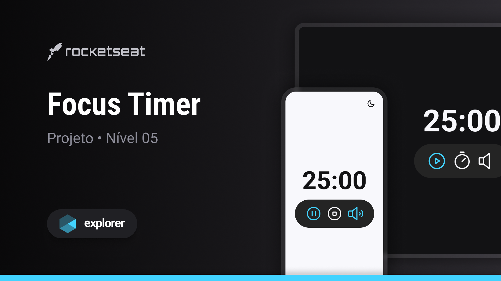

<h1 align="center">Focus Timer</h1>

<p align="center">
  Projeto retirado do programa Explorer, um programa de estudo exclusivo promovido pela Rocketseat para o ensino de tecnologias web.
</p>

<div align="center">
  <a href="#-layout">Layout</a>&nbsp;&nbsp;&nbsp;|&nbsp;&nbsp;&nbsp;
  <a href="#-aprendizado">Aprendizado</a>&nbsp;&nbsp;&nbsp;|&nbsp;&nbsp;&nbsp;
  <a href="#-projeto">Projeto</a>&nbsp;&nbsp;&nbsp;|&nbsp;&nbsp;&nbsp;
  <a href="#-tecnologias">Tecnologias</a>&nbsp;&nbsp;&nbsp;|&nbsp;&nbsp;&nbsp;
  <a href="#-referências">Referências</a>&nbsp;&nbsp;&nbsp;|&nbsp;&nbsp;&nbsp;
  <a href="#-licença">Licença</a>
</div>

<br />

<div align="center">
  
</div>

<br />

<div align="center">
  
</div>

## 🎨 Layout

Você pode visualizar o layout do projeto através [DESSE LINK](https://www.figma.com/community/file/1263574581735209131/Focus-Timer-V2-%E2%80%A2-Projeto-Explorer).

## 📖 Aprendizado

- Aprimorei minhas habilidades em lógica de programação;
- Adquiri conhecimentos em adicionar sons através do JavaScript;
- Dominei Nullish Coalescing Operator;
- Apliquei meus conhecimentos em ES Modules na prática;
- Refinei minha compreensão sobre Clean Code;
- Adquiri novos conceitos relacionados à acessibilidade;
- Aprendi a utilização de destructuring no JavaScript.

## 💻 Projeto

O projeto tinha como propósito desenvolver um timer no estilo Pomodoro com JavaScript e ES Modules, incluindo funcionalidades de iniciar, pausar, reiniciar e ajustar o contador. Além disso, buscava fornecer opções de tema claro/escuro, controle de música e suporte à acessibilidade.

Você tem a opção de personalizar o valor padrão do Focus Timer (25:00) ao acessar o arquivo [main.js](https://github.com/kauankarvalho/Focus-Timer/blob/main/src/js/main.js). Simplesmente forneça um novo valor como argumento para a função focusTimer para ajustá-lo de acordo com suas preferências.

```
focusTimer(minutes, seconds)
```

O Focus Timer possui um validador que restringe os minutos a um limite máximo de 60, enquanto os segundos podem ser ajustados em incrementos de 30 segundos.

## 🧪 Tecnologias

Esse projeto foi desenvolvido com as seguintes tecnologias:

- [HTML](https://developer.mozilla.org/pt-BR/docs/Web/HTML)
- [Tailwind CSS](https://tailwindcss.com)
- [JavaScript](https://developer.mozilla.org/pt-BR/docs/Web/JavaScript)

## ✒️ Referências

- Música [WYS - Snowman](https://www.youtube.com/watch?v=j9ziXYpFs1I&ab_channel=LofiGirl)

## 📝 Licença

Este projeto está sob a licença MIT. Consulte o arquivo [LICENSE](https://github.com/kauankarvalho/Focus-Timer/blob/main/LICENSE) para obter mais detalhes.